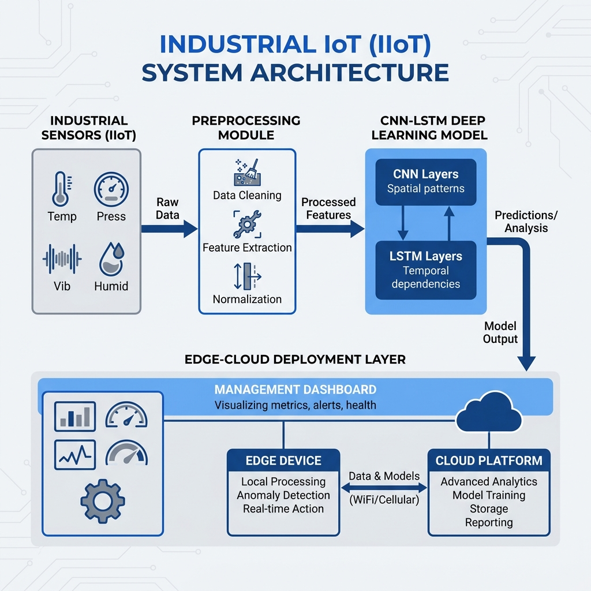

# Edge-Cloud Smart Factory: Predictive Maintenance & Routing-Aware Simulation

[](https://www.python.org/downloads/)
[](https://flutter.dev/)
[](https://opensource.org/licenses/MIT)

This repository contains the official implementation of the **Edge-Cloud Smart Factory Framework**, as presented in our research paper. The system integrates deep learning-based Remaining Useful Life (RUL) estimation with a real-time digital twin for routing optimization in industrial environments.

---

## 🏗️ System Architecture

The framework is split into two primary layers:
1.  **Cloud Layer (Backend)**: Handles heavy-duty training (CNN-LSTM), data persistence (SQLite/SQLAlchemy), and the Simulation Engine (SimPy).
2.  **Edge/Operator Layer (Frontend)**: A high-fidelity Flutter dashboard for real-time telemetry monitoring, layout editing, and "What-If" scenario analysis.



## 🖥️ Dashboard Interface


---

## 🚀 Key Features

*   **Predictive Maintenance**: CNN-LSTM model achieving **RMSE: 57.29** on the IndFD-PM-DT dataset.
*   **Routing-Aware Simulation**: Adaptive routing policies (Weighted Cost, Least Loaded, Round Robin) that respond to predicted machine failures.
*   **Digital Twin Layout Editor**: Drag-and-drop interface to design and stress-test factory floors.
*   **What-If Analysis**: Branching simulation to predict the impact of maintenance schedules or demand changes before implementation.

---

## 🛠️ Installation & Setup

### Backend (Python)
1. Navigate to the backend directory:
   ```bash
   cd backend
   ```
2. Create a virtual environment and install dependencies:
   ```bash
   python -m venv venv
   source venv/bin/activate  # Or `venv\Scripts\activate` on Windows
   pip install -r requirements.txt
   ```
3. Start the API server:
   ```bash
   python api_server.py
   ```

### Frontend (Flutter)
1. Ensure you have the [Flutter SDK](https://docs.flutter.dev/get-started/install) installed.
2. Navigate to the frontend directory:
   ```bash
   cd frontend
   ```
3. Install dependencies and run:
   ```bash
   flutter pub get
   flutter run -d windows # Or your preferred platform
   ```

---

## 📊 Reproducing Research Results

To verify the metrics (RMSE/MAE) reported in the paper:
```bash
python reproduce_results.py
```
This script will load the saved `.keras` model and evaluate it against the held-out machine-level test set.

---

## 📁 Repository Structure

```text
├── backend/
│   ├── ml/             # CNN-LSTM Architecture & Prediction Service
│   ├── simulation/     # SimPy-based Factory Engine
│   ├── routing/        # RoutingEngine & Policy Logic
│   ├── data/           # SQLite DB & Preprocessed Datasets
│   └── training/       # Training scripts and ablation studies
├── frontend/           # Flutter Dashboard Source Code
├── paper_figures/      # High-resolution figures for publication
└── rp.tex              # LaTeX source for the conference paper
```

---

## 📝 Citation

If you use this work in your research, please cite:

```bibtex
@inproceedings{singh2026edgecloud,
  title={Edge-Cloud Smart Factory Framework for Predictive Maintenance and Routing-Aware Simulation},
  author={Singh, Ayush and Jaiswal, Sadgi},
  booktitle={Proceedings of [Conference Name]},
  year={2026}
}
```

---
**Authors**: Ayush Singh & Sadgi Jaiswal  
**Institution**: Dayananda Sagar University, Bangalore, India
